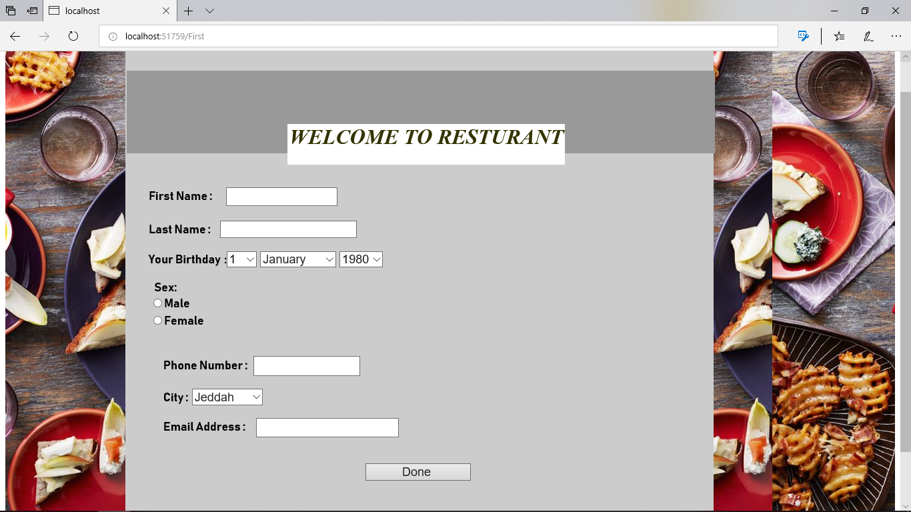
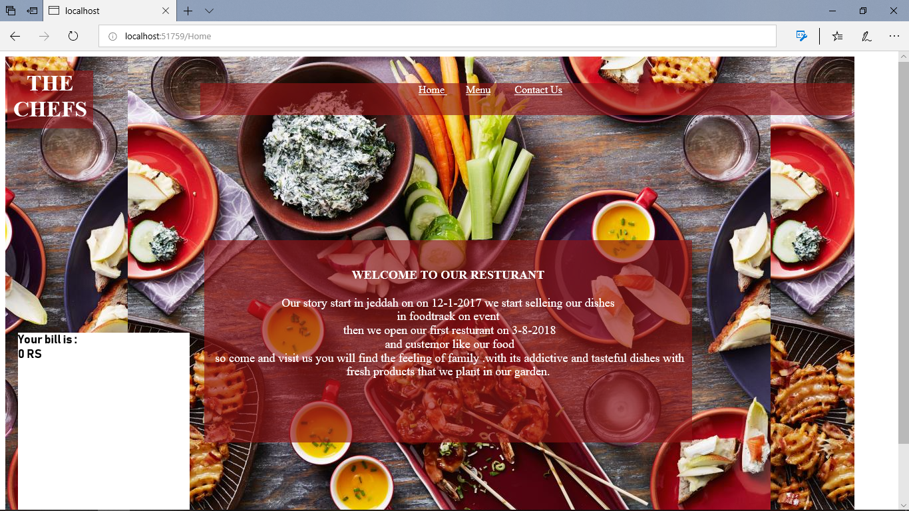
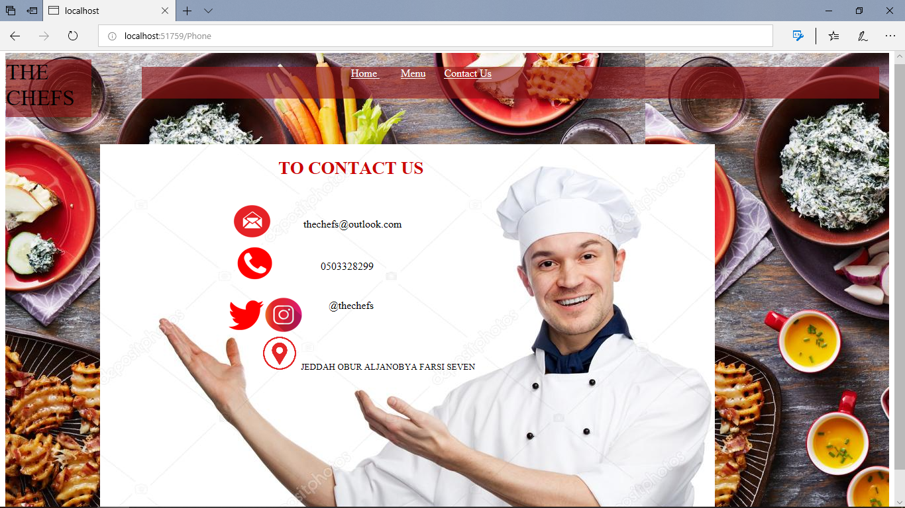
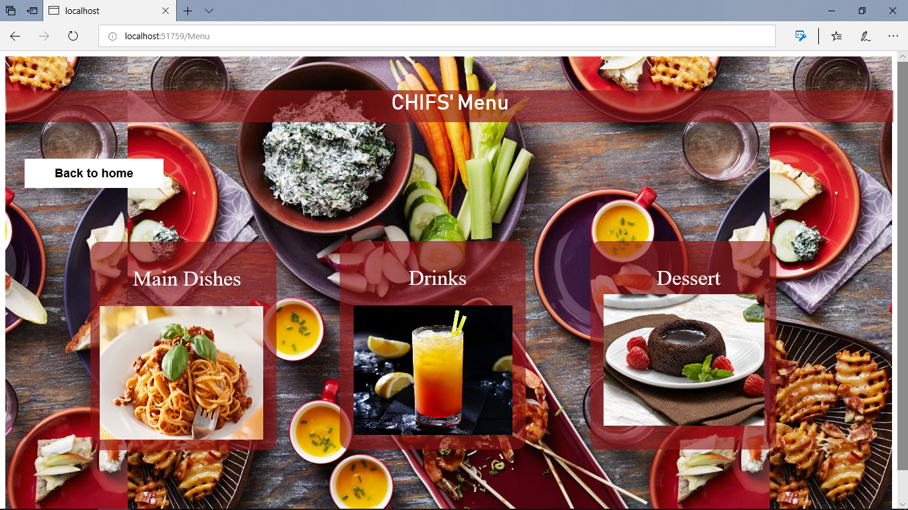
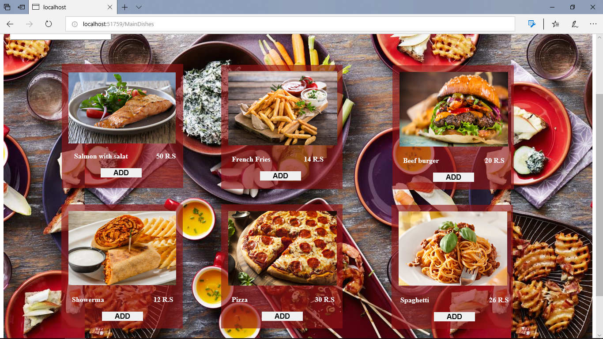
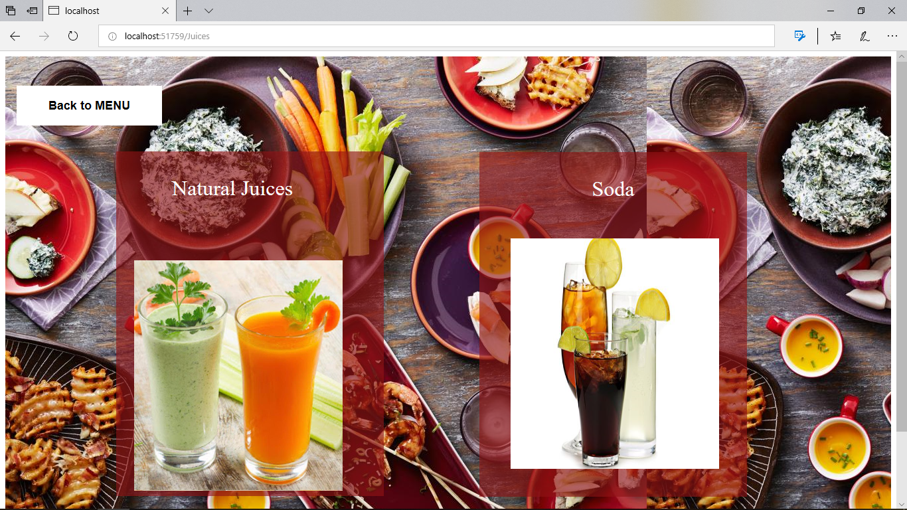
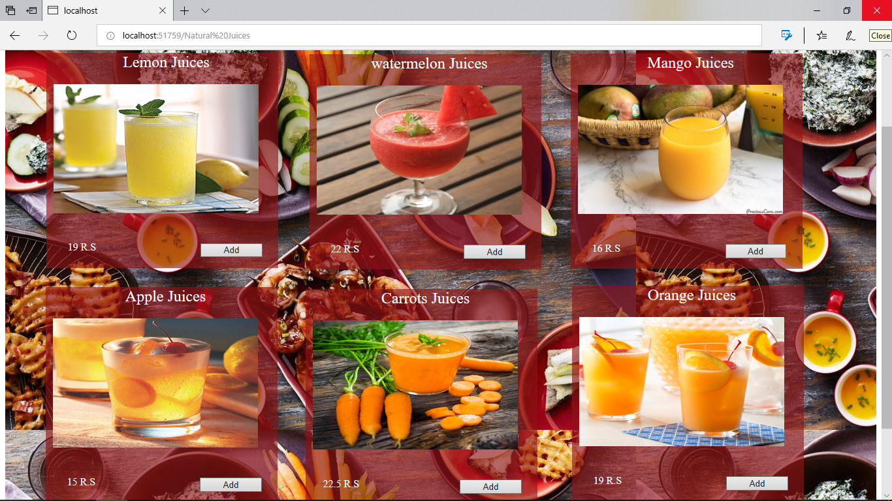
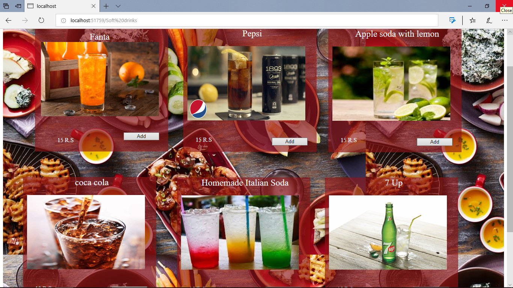
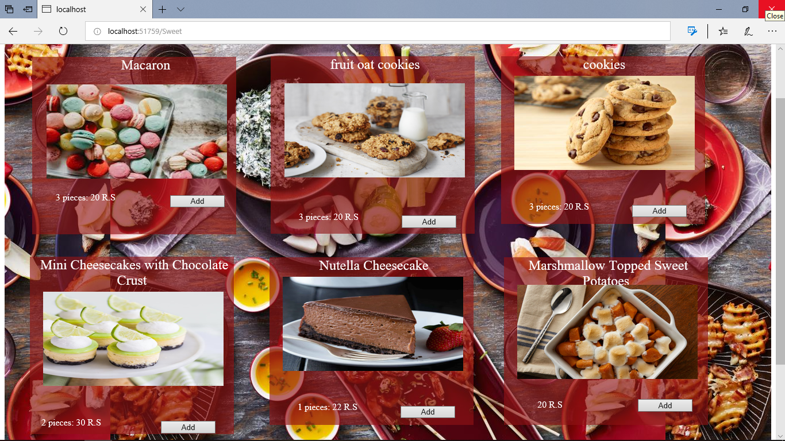

# The scope : 
We have used c# programming language at visual studio editor because it is simple , modern and easy to use .

## The brief description :
Our program contains 9 different webforms displays: 

### 1-	Registration :
On this page you should sign up and write your information so you can order the dishes.

### 2-	Home : 
In this page will display a little description about us and our restaurant and able you traverse between other pages ( Menu , Contact us ) , and displays the bill whenever you finish your order   

### 3-	Contact us :
In this page you can find how to contact us by multi choices .

### 4-	Menu :
In this page you will find different categories of menu .

### 5-	Main Dishes Menu :
In this page you will find main dishes with its prices and easily you can add it to the bill . 

### 6-	Drinks : 
In this page you will find two choice of drinks  ( Natural juices , Soda ). 

Then if you pressed Natural Juices :
### 7-	Natural Juices :
in this page you will find different kind of Juices with its prices and easily you can add it to the bill . 

But if you pressed Soda : 
### 8-	Soda :
in this page you will find different kind of drinks with its prices and easily you can add it to the bill . 

### 9-	Dessert :
in this page you will find different kind of sweets with its prices and easily you can add it to the bill . 

